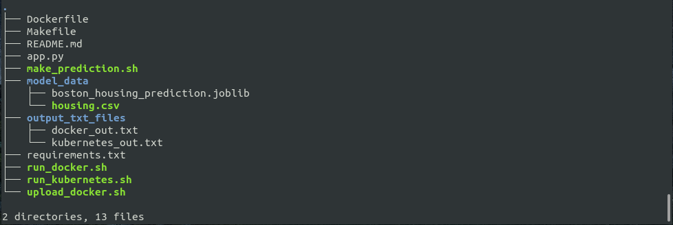
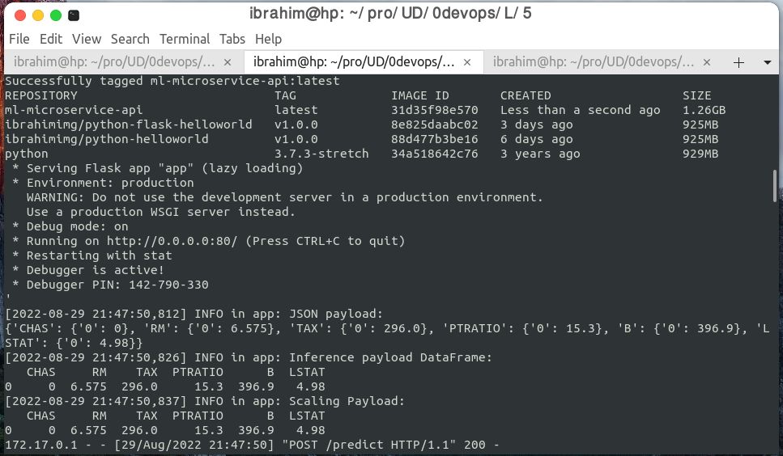
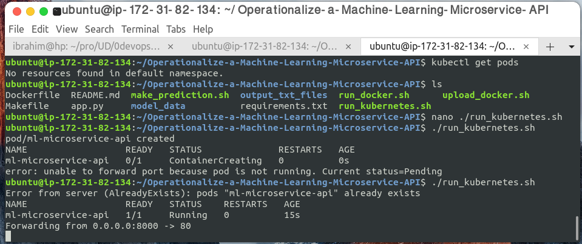
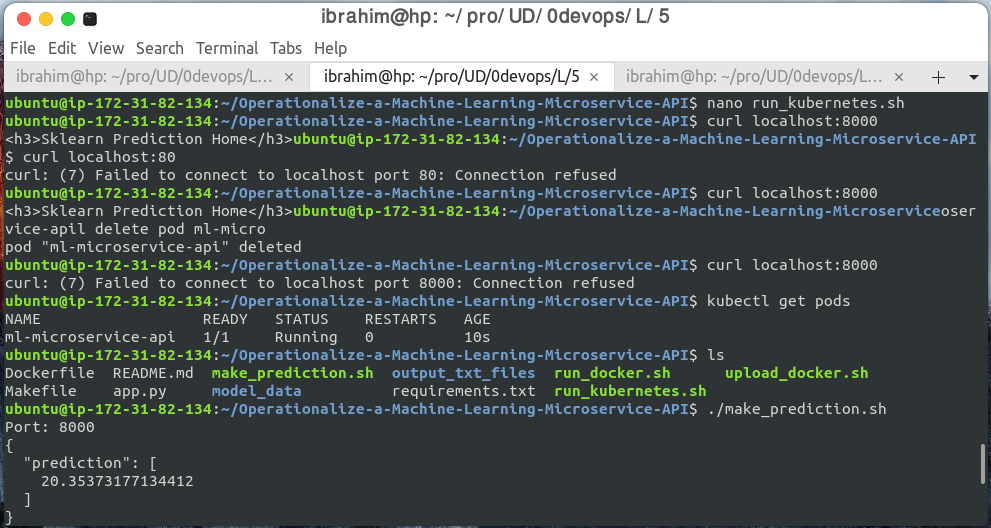

[](https://app.circleci.com/pipelines/github/ibrahimimg/Operationalize-a-Machine-Learning-Microservice-API)

## Project Overview

In this project, you will apply the skills you have acquired in this course to operationalize a Machine Learning Microservice API. 

You are given a pre-trained, `sklearn` model that has been trained to predict housing prices in Boston according to several features, such as average rooms in a home and data about highway access, teacher-to-pupil ratios, and so on. You can read more about the data, which was initially taken from Kaggle, on [the data source site](https://www.kaggle.com/c/boston-housing). This project tests your ability to operationalize a Python flask app—in a provided file, `app.py`—that serves out predictions (inference) about housing prices through API calls. This project could be extended to any pre-trained machine learning model, such as those for image recognition and data labeling.

### Project Tasks

Your project goal is to operationalize this working, machine learning microservice using [kubernetes](https://kubernetes.io/), which is an open-source system for automating the management of containerized applications. In this project you will:
* Test your project code using linting
* Complete a Dockerfile to containerize this application
* Deploy your containerized application using Docker and make a prediction
* Improve the log statements in the source code for this application
* Configure Kubernetes and create a Kubernetes cluster
* Deploy a container using Kubernetes and make a prediction
* Upload a complete Github repo with CircleCI to indicate that your code has been tested

You can find a detailed [project rubric, here](https://review.udacity.com/#!/rubrics/2576/view).

**The final implementation of the project will showcase your abilities to operationalize production microservices.**

---

## Project Directory Structure



| Name |  Description    |
|------|-----------------|
|.     | the root folder which contains folders, source files|
|.circleci   | this folder contains a config file that will be used by circleci|
|model_data| This folder contains a sklearn model that has been trained to predict housing prices in Boston |
|output_txt_files | this folder contains a terminal output of run_docker.sh and run_kubernetes|
|make_predication.sh  | used to get the prediction's result through API|
|app.py | flask application for API|
|Dockerfile | Dockerfile file with instructions to build a Docker image |
|Makefile |  Makefile defines a set of tasks to be executed, such as setup, install etc|
|README.md| project documentation
|requirements.txt|list of python libraries required by this project, to be installed with pip|
|run_docker.sh  | bash script to build and run docker automatically|
|run_kubernetes.sh  | This script run docker with kubernetes |
|upload_docker.sh  | This script tags and uploads an image to Docker Hub|

## Setup the Environment

* Create a virtualenv with Python 3.7 and activate it. Refer to this link for help on specifying the Python version in the virtualenv. 
```bash
python3 -m pip install --user virtualenv
# You should have Python 3.7 available in your host. 
# Check the Python path using `which python3`
# Use a command similar to this one:
python3 -m virtualenv --python=<path-to-Python3.7> .devops
source .devops/bin/activate
```
* Run `make install` to install the necessary dependencies

### Running `app.py`

1. Standalone:  `python app.py`
2. Run in Docker:  `./run_docker.sh`
3. Run in Kubernetes:  `./run_kubernetes.sh`



### Kubernetes Steps

* Setup and Configure Docker locally

    1. You will need to use Docker to build and upload a containerized application. If you already have this installed and created a docker account, you may skip this step.


    2. You’ll need to [create a free docker account](https://hub.docker.com/signup) , where you’ll choose a unique username and link your email to a docker account. Your username is your unique docker ID.

    3. To install the latest version of docker, choose the Community Edition (CE) for your operating system, on docker’s installation site. It is also recommended that you install the latest, stable release:

    4. After installation, you can verify that you’ve successfully installed docker by printing its version in your terminal
    
            docker --version

* Create Flask app in Container

    In order to run a containerized application, you’ll need to build and run the docker image that you defined in the Dockerfile, and then you should be able to test your application, locally, by having the containerized application accept some input data and produce a prediction about housing prices. 
    
        run_docker.sh

* Setup and Configure Kubernetes locally

    To deploy this application using kubectl, open and complete the file, [run_kubernetes.sh](run_kubernetes.sh):

    The steps will be somewhat similar to what you did in both run_docker.sh and upload_docker.sh but specific to kubernetes clusters. Within [run_kubernetes.sh](run_kubernetes.sh), complete the following steps:

    1. Define a dockerpath which will be “/path”, this should be the same name as your uploaded repository (the same as in upload_docker.sh)
    2. Run the docker container with kubectl; you’ll have to specify the container and the port
    3. List the kubernetes pods
    4. Forward the container port to a host port, using the same ports as before

        After completing the code, call the script [./run_kubernetes.sh](./run_kubernetes.sh). This assumes you have a local cluster configured and running. This script should create a pod with a name you specify and you may get an initial output that looks as follows, with a cluster and status

        

Prediction Result with Kubernetes


